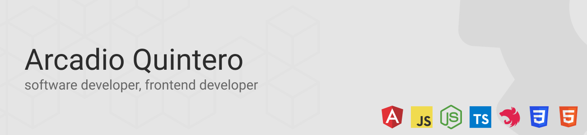

  

## About me
👋 Passionate software engineer from Panama located in Ontario, Canada, with over 16 years of experience in web development.

💻 I've worked extensively with various programming languages such as PHP, Typescript, and JavaScript. I have deep knowledge in frameworks like Angular, NestJS, and CakePHP, leveraging their power to create robust and scalable applications.

🌟 I'm passionate about continuous learning and staying updated with the latest trends in the ever-evolving field of software development. 

