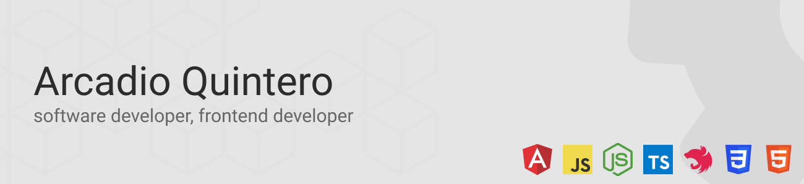

## About me

👋 Systems Engineer from Panama 🇵🇦, based in Ontario, Canada 🇨🇦, with over 17 years building for the web.

🅰️ **Google Developer Expert in Angular** and co-organizer of [NgPanama](https://github.com/NgPanama).

💼 Senior Software Engineer at [@dotCMS](https://github.com/dotCMS). I ship features across the product's Angular UI — experiments, content editing, the image and block editors — along with the architecture, framework upgrades and build tooling underneath them.

🤖 The other half of my work is AI in the development workflow: building agents and Claude Code plugins for code review and delivery, MCP integrations over internal tooling, and LLM features that reach users. I do the same on my own time in RigDash, with Vertex AI and Google Cloud.

💻 Angular, TypeScript and NestJS day to day, with a long tail of PHP and JavaScript behind me.

## 🏗️ Currently building

**[RigDash](https://rigdash.io)** — a multi-gym SaaS for CrossFit boxes that I build on my own, end to end.

Recurring billing gates bookings for unpaid members, and an AI assistant on Vertex AI + Google ADK drafts the coach's weekly WOD programming for review. Copilot, not autopilot.

`Angular 22` `NgRx Signals` `NestJS 11` `PostgreSQL` `Prisma` `Vertex AI` `Google Cloud` `Nx` `Playwright`

## ✍️ Writing

I publish in English and Spanish at **[arcadioquintero.com](https://arcadioquintero.com/)**:

- [Angular Signal Forms: What Changes and How to Use Them](https://arcadioquintero.com/en/blog/angular-signal-forms-architecture-deep-dive/)
- [NgRx SignalStore Events: The Power of Events in Your State](https://arcadioquintero.com/en/blog/ngrx-signalstore-events-plugin/)
- [Angular 21 MCP: 6 Stable Tools + 1 Experimental You Should Know](https://arcadioquintero.com/en/blog/angular-21-mcp-6-stable-tools-1-experimental-you-should-know/)
- [Stop Writing Outdated Angular Code: MCP Setup with Cursor & Claude Code](https://arcadioquintero.com/en/blog/stop-writing-outdated-angular-code-mcp-setup-with-cursor-and-claude-code/)

## 🧰 Stack

